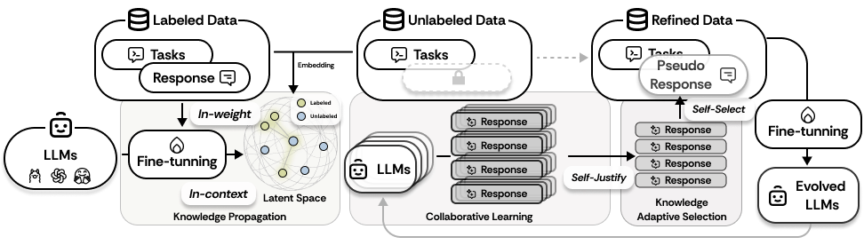

# SemiEvol

This repository contains the official implementation of the paper: **SemiEvol: Semi-supervised Fine-tuning for LLM Adaptation**.

## TLDR

We have developed the SemiEvol process, which leverages labeled data to enhance inference on unlabeled data, thereby improving the reasoning capabilities of Large Language Models (LLMs). This process is characterized as a bi-level knowledge propagation and selection mechanism.

## BibTex

If our work has been helpful to you, please consider citing it. Your citation serves as encouragement for our research.


## Framework



SemiEvol maximizes the utility of labeled data through a bi-level knowledge *propagation-and-selection* framework, while leveraging collaborative learning among multiple LLMs to exploit unlabeled data, unleashing the full data potential. 

## Installation

Install dependencies using the requirements.txt file:

```bash
pip install -r requirements.txt
```

## Dataset and Released Model Weights

- Dataset: https://huggingface.co/datasets/luojunyu/SemiEvol

We have released model weights for two tasks to facilitate testing:

- SemiEvol on MMLU based on Llama-3.1-8B: https://huggingface.co/luojunyu/Llama-3.1-8B-SemiEvol-MMLU
- SemiEvol on MMLU-Pro based on Llama-3.1-8B: https://huggingface.co/luojunyu/Llama-3.1-8B-SemiEvol-MMLUPro

## Usage

- For **evaluation**, execute:

```python
python eval.py
```
You can modify relevant parameters, including task and model, in `eval.py`.

- To run the **SemiEvol** process, use:

```python
python semievol.py
```
You can adjust parameters such as task, model, and other hyperparameters in `semievol.py`.

- For evaluation of **RAG** methods, run:

```python
python rag-eval.py
```

- To convert data for fine-tuning, use:

```python
python utils/convert_data.py
```

**Please modify the parameters in the code before execution.**


- For Supervised Fine-Tuning (SFT) on Llama, we recommend referring to [LlamaFactory](https://github.com/hiyouga/LLaMA-Factory/). In our paper's experiments, we utilized LoRA for LLMs' SFT.


- For SFT on GPT*, please refer to https://platform.openai.com/finetune and https://platform.openai.com/docs/guides/fine-tuning.


- After SFT, consider using inference frameworks like vLLM to infer your model. **Note that you need to register your model in `config.py`.**